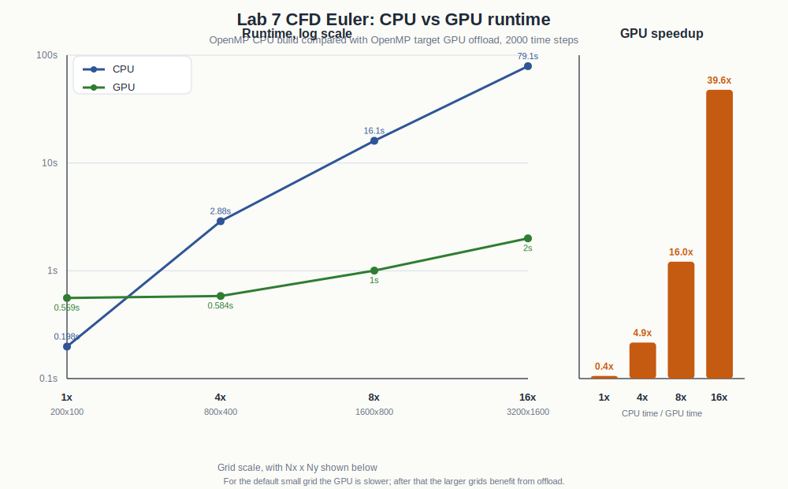

# Lab 7 results

I added an OpenMP GPU version of `cfd_euler.cpp` and compared it to a CPU OpenMP build.

The timings are in `runtime_comparison.csv`. I also added a chart in `runtime_comparison_chart.svg` so the CPU/GPU comparison is easier to read.



I used the default grid and then scaled both `Nx` and `Ny` by 4, 8, and 16.

Extra files that are not needed for the main result are in `supporting_files/`. That folder has the GPU compiler report and the raw one-line outputs from each run.

Build commands used:

```bash
nvc++ -mp -Ofast cfd_euler.cpp -o cfd_euler_cpu
nvc++ -mp=gpu -gpu=cc80 -Ofast -DUSE_GPU cfd_euler.cpp -o cfd_euler_gpu -Minfo=accel,mp
```

Run setup:

```bash
srun -p gpu --gres=gpu:1 --ntasks=1 --cpus-per-task=4 --time=00:20:00 --mem=40G ...
```

Results:

```text
scale  grid          CPU time     GPU time
1x     200 x 100     0.198047 s   0.559403 s
4x     800 x 400     2.883770 s   0.583995 s
8x     1600 x 800    16.078298 s  1.004059 s
16x    3200 x 1600   79.082516 s  1.999538 s
```

The CPU and GPU final kinetic energy matched for all four sizes. The GPU is slower for the smallest case, but it becomes much faster once the grid is large enough.
